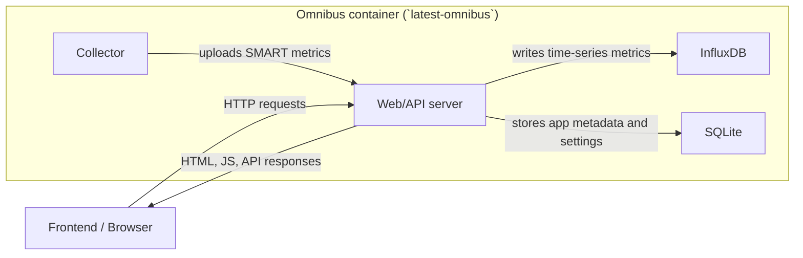
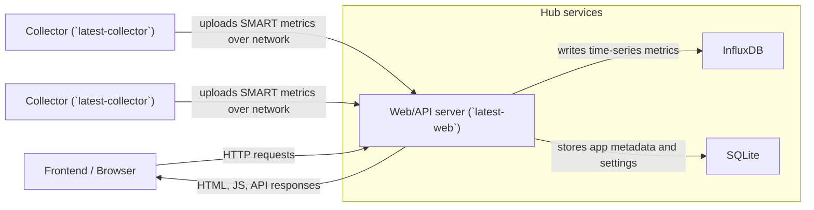

# Scrutiny Architecture

This page shows how Scrutiny's main runtime components fit together in the two deployment models supported by this repository.

## Omnibus

The `ghcr.io/starosdev/scrutiny:latest-omnibus` image bundles the collector, web/API server, InfluxDB, and SQLite into a single container. The browser frontend is served by the web/API server and talks to it over HTTP.

- The collector discovers devices and submits SMART data to the local web/API service.
- InfluxDB stores time-series drive metrics and historical readings.
- SQLite stores application metadata such as device records, settings, and UI-managed configuration.
- The frontend is delivered by the same web/API service, so all browser traffic terminates at the omnibus container.

## Hub/Spoke

The Hub/Spoke deployment separates the collector from the central web/API service. One or more `latest-collector` containers run on the systems that have access to disks, then send their results to a hub running `latest-web` plus its databases.

- Collectors run close to the disks they monitor and communicate with the hub over the network.
- The hub's web/API service aggregates data from all spokes and serves the frontend.
- InfluxDB remains the time-series store for SMART history.
- SQLite remains the metadata store for device records, settings, and other app state managed by the web/API layer.

## Component Roles

- `Collector`: discovers devices, runs `smartctl`, and submits results to the API.
- `Web/API server`: accepts collector uploads, serves the frontend, and provides the API consumed by the UI.
- `InfluxDB`: stores historical SMART and other time-series measurements.
- `SQLite`: stores application metadata and configuration state.
- `Frontend / Browser`: renders the dashboard and calls the API exposed by the web/API server.
